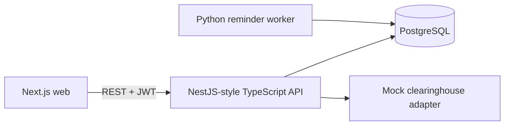
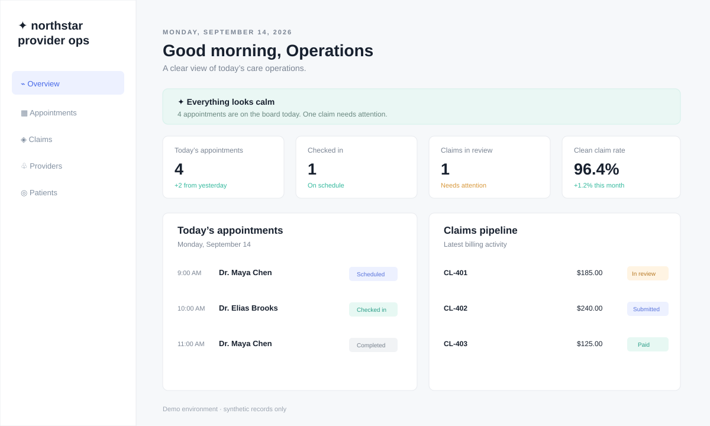

# Provider Ops

Provider Ops is a healthcare-adjacent operations dashboard for a fictional care network. It helps an operations coordinator spot appointment risk, understand claim throughput, and keep an auditable trail of changes. All records are generated demo data; the app is not intended for real patient data or clinical decisions.

## Features

- Demo authentication with `admin`, `scheduler`, and `billing` roles
- Provider, synthetic patient, appointment, claim, and audit-log management
- Appointment conflict validation, status changes, search, filters, sorting, and pagination
- Claims pipeline with submitted / in review / paid / denied states
- Swagger-style REST API reference at `/docs`
- Python reminder worker that produces a dry-run notification report
- PostgreSQL schema with indexes and SQL migrations
- React/Next.js dashboard with responsive layout
- Jest + Supertest API tests and React Testing Library UI tests
- Docker Compose for local orchestration and Render blueprint for deployment

## Why this project

This portfolio project is designed to demonstrate the exact full-stack workflow expected in a Node.js / Python / SQL / Docker healthcare product team: typed REST APIs, responsive React UI, relational schema design, automation, tests, CI, code-quality hooks, and deployment-aware documentation. See the [role alignment walkthrough](docs/role-alignment.md).

## Architecture



The API is bootstrapped by NestJS (`AppModule` + `NestFactory`) over an Express-compatible route layer. This keeps the request lifecycle familiar while giving the service a real NestJS composition root for adding controllers, DTOs, and feature modules.

## Tech stack

Next.js, React, TypeScript, Express concepts, PostgreSQL, SQL migrations, Python, Jest, Supertest, React Testing Library, Playwright-ready scripts, Docker Compose, GitHub Actions, and Render infrastructure-as-code.

## Running locally

```bash
cp .env.example .env
npm install
docker compose up -d postgres
npm run db:migrate
npm run db:seed
npm run dev
```

Open [http://localhost:3000](http://localhost:3000). Use the demo sign-in button; credentials are intentionally non-secret (`demo@northstar.test` / `demo-password`).

## Environment variables

See [.env.example](.env.example). Never commit real secrets. Production deployments must supply a managed PostgreSQL URL and rotate `JWT_SECRET`.

## Database setup

`apps/api/migrations/001_initial.sql` creates tables and search indexes. `npm run db:migrate` applies it; `npm run db:seed` inserts synthetic records. The API also has an in-memory fallback so the UI can be previewed without PostgreSQL.

## Testing

```bash
npm test
npm run lint
```

The API suite covers authentication, pagination, appointment conflict validation, and audit events. The web suite covers dashboard filters and claim status presentation. Add Playwright smoke tests against the Docker Compose stack for a full browser run.

## API documentation

Start the API, then visit [http://localhost:4000/docs](http://localhost:4000/docs) or read the OpenAPI document at [apps/api/openapi.yaml](apps/api/openapi.yaml). Main routes include `POST /api/auth/login`, `GET /api/appointments`, `POST /api/appointments`, `PATCH /api/appointments/:id/status`, `GET /api/claims`, and `GET /api/audit-logs`.

## Deployment

`render.yaml` provisions a Docker-based API, web service, and PostgreSQL database. Deploy it from the Render dashboard after connecting the repository, then set the web service's `NEXT_PUBLIC_API_URL` to the API URL. A live demo link is intentionally not fabricated in this repository; publish the generated Render URL here after deployment.

Live demo: pending first Render deployment. The repository is deployment-ready, but no hosting account or public URL is available in this workspace.

Azure path: deploy the API and web Docker images to Azure Container Apps, attach Azure Database for PostgreSQL Flexible Server, and run the Python reminder command as a Container Apps Job or scheduled GitHub Actions workflow. The service boundaries in this repository are intentionally compatible with that migration.

## Engineering decisions

- Synthetic data only: no real names, identifiers, or external patient system.
- API-first boundary: the web app uses the same REST endpoints a future mobile client could use.
- Conflict checks live in the service layer and are backed by a database index for fast date/provider lookups.
- Audit events are append-only and record actor, action, entity, and metadata.

## Known limitations

- Demo auth is intentionally simple and should be replaced with an OIDC provider before production.
- The fallback store is for preview only; production requires PostgreSQL.
- The clearinghouse is a deterministic mock adapter.
- Accessibility and browser coverage are starter-level, not a compliance certification.

## Demo media



The preview uses synthetic records only and contains no patient imagery. A short browser recording can be captured from the same seeded dashboard after deployment.
